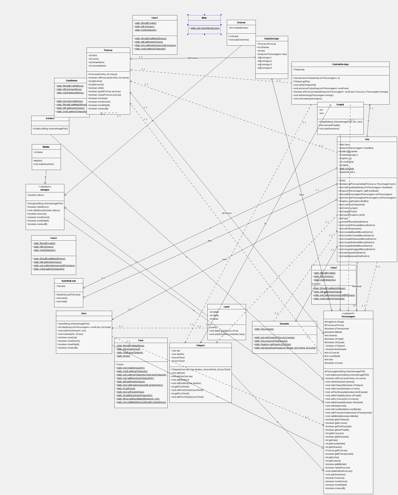
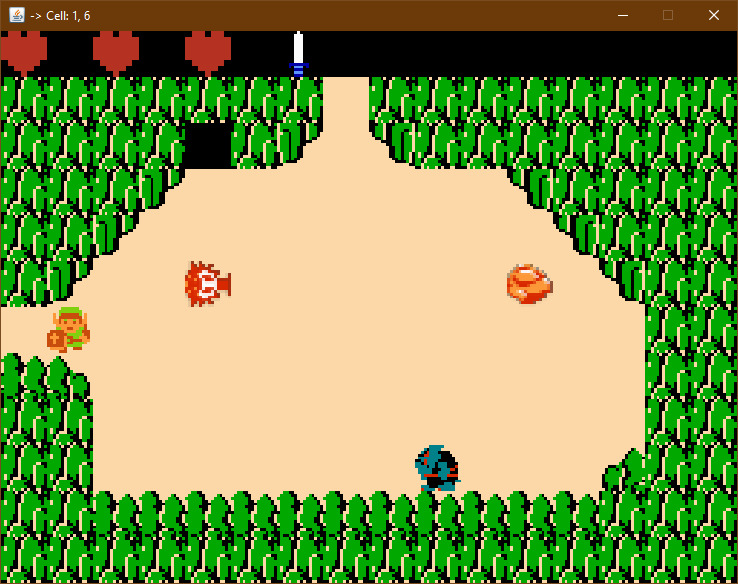
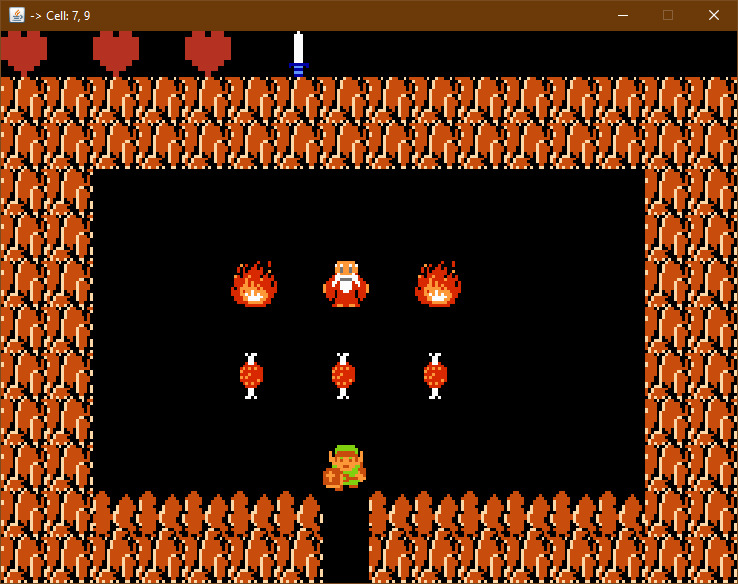
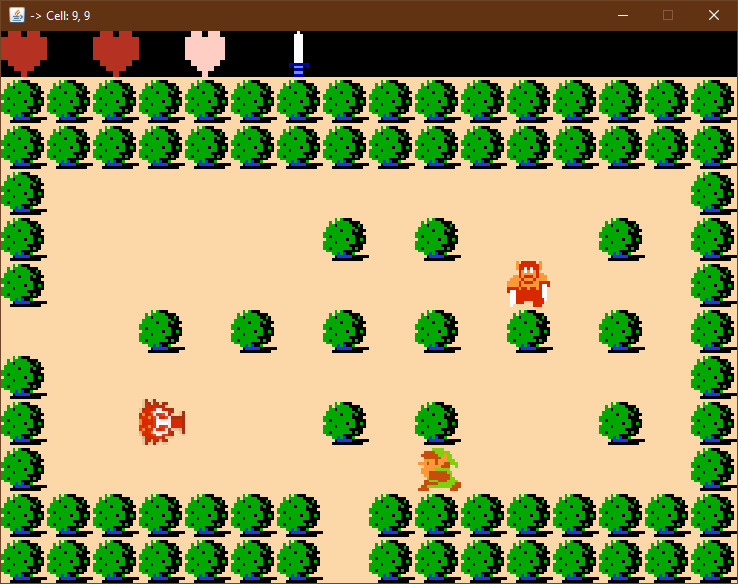
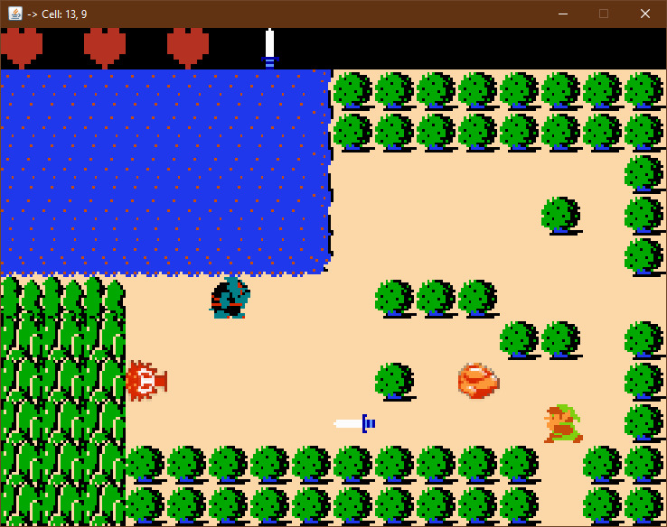
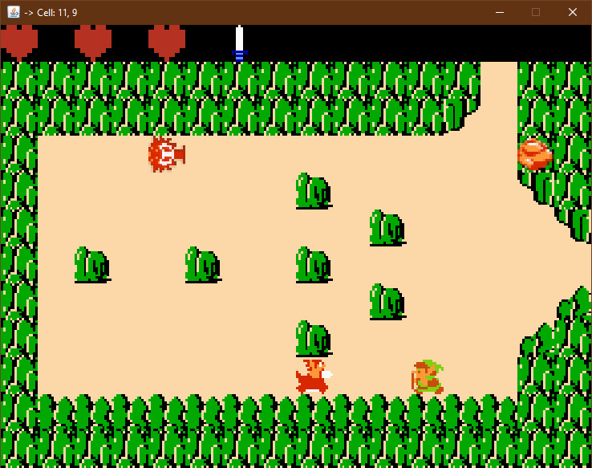

# The Legend of Zelda Remake

## Final Project - Object-Oriented Programming Course

### University of São Paulo
### SCC604 - Object-Oriented Programming

**Authors:**
- Henrique de Oliveira Araújo - 13863950
- André Jacob Suaide - 13864673

## About the Project

This project is a remake of Nintendo's 1986 electronic game, The Legend of Zelda, developed as part of the Object-Oriented Programming course. We used the Java programming language to implement various object-oriented concepts such as inheritance, polymorphism, and encapsulation.

### Objectives
- Apply the knowledge acquired during the course.
- Develop an application that represents real-world abstractions and entities in differentiated objects.
- Implement graphical functionalities and manipulation of serializable objects using Java.

## Development

The implementations were carried out using the NetBeans development environment, which supports various programming languages, including Java. We used the logical structure provided by the professor as a starting point to execute the graphical functionalities and manipulate serializable objects.

### UML Diagram
The project's Unified Modeling Language (UML) diagram was automatically generated using a plugin in NetBeans:


## Project Screenshots







## How to Run

1. Clone this repository:
   ```bash
   git clone https://github.com/your-username/zelda-remake.git

2. Download Netbeans IDE
3. Run the project
